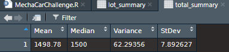
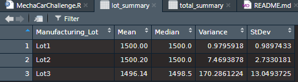

# MechaCar_Statistical_Analysis

## Linear Regression to Predict MPG

The strongest contributor of non-random variance seems to be the vehicle length with a p-value of 2.60e-12.  The other strong contributor of non-random variance is the ground clearance with a p-value of 5.21e-8.

The slope of the linear model is not zero.  We can see that the slope coefficients contain significant non-zero values (vehicle length, ground clearance, and AWD), and the p-values are less than the significance level of p=0.05.

Our r^2 value is 0.7149, which means the model does have good predictive power for the mpg.

## Summary Statistics on Suspension Coils

In the total summary, we can see the variance of all three lots in tandem does fall under the maximum variance of 100 PSI with a variance of 62 PSI.

In the lot summary, we see that the major contributor to the variance is lot 3 with a variance of 170 PSI with the other two lots having variances below 8 PSI.

In total, the manufacturing data meets the maximum variance in PSI requirement, but we can see that there are clearly big problems in lot 3 with a variance of 170 PSI.  Lot 3 does not meet the maximum variance requirement.